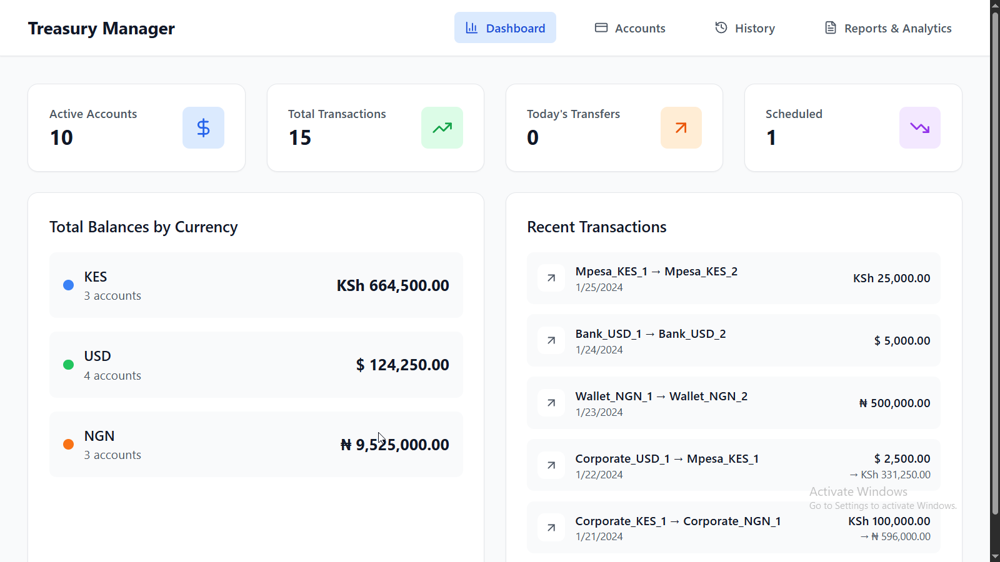
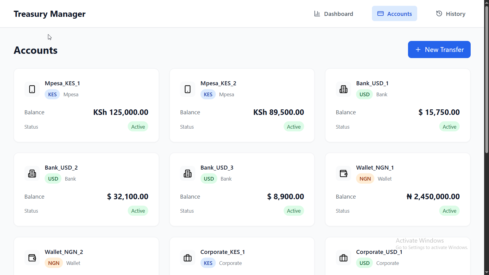
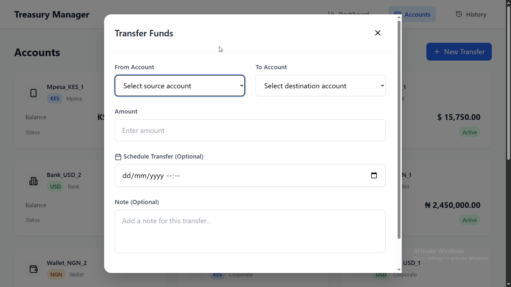
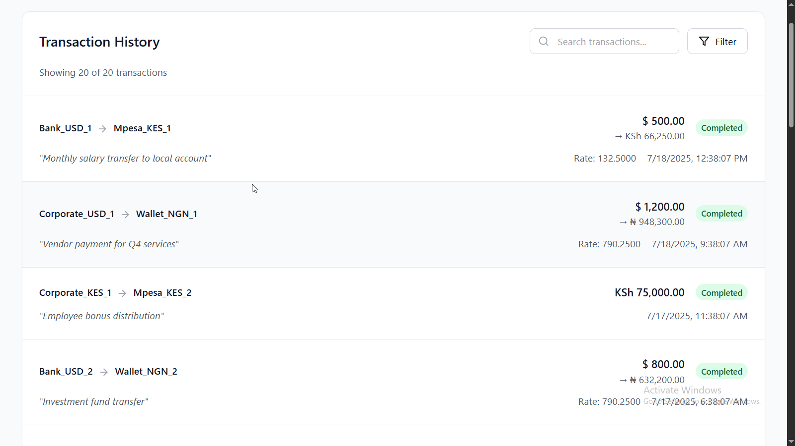
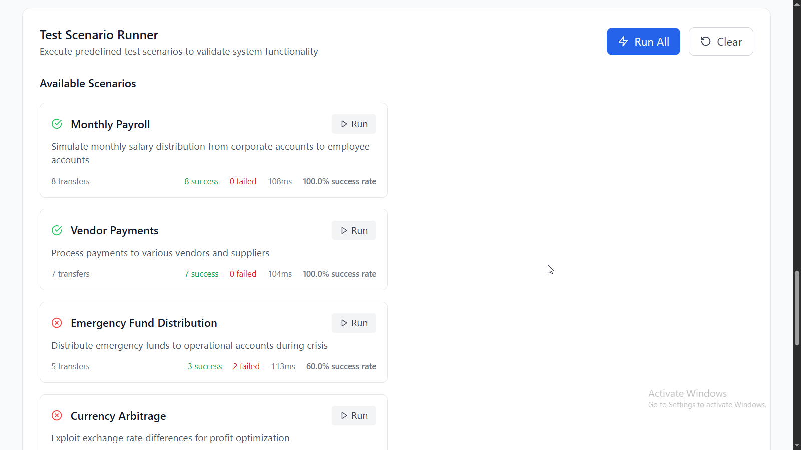

# Treasury Movement Simulator


A sophisticated financial management application for simulating and managing treasury operations across multiple currencies and account types. Built with React, TypeScript, and Tailwind CSS.

## Live Link: (https://treasury-move-sim.netlify.app/)

## 🌟 Features

### Core Functionality
- **Multi-Currency Support**: Handle KES (Kenyan Shilling), USD (US Dollar), and NGN (Nigerian Naira)
- **Real-time Currency Conversion**: Automatic exchange rate calculations for cross-currency transfers
- **Account Management**: Support for multiple account types (Mpesa, Bank, Wallet, Corporate)
- **Transaction Processing**: Instant and scheduled transfers with comprehensive validation
- **Transaction History**: Detailed transaction logs with advanced filtering and search

### Advanced Features
- **Test Scenario Runner**: Execute predefined business scenarios for system validation
- **Dashboard Analytics**: Real-time insights into account balances and transaction patterns
- **Responsive Design**: Optimized for desktop, tablet, and mobile devices
- **Performance Testing**: Built-in stress testing capabilities
- **Data Validation**: Comprehensive input validation and error handling

### Account Types
- **Mpesa**: Mobile money accounts for Kenya
- **Bank**: Traditional banking accounts
- **Wallet**: Digital wallet accounts
- **Corporate**: Business and enterprise accounts

### Supported Currencies
- **KES** (Kenyan Shilling) - Symbol: KSh
- **USD** (US Dollar) - Symbol: $
- **NGN** (Nigerian Naira) - Symbol: ₦

## 🏗️ Architecture

### Technology Stack
- **Frontend**: React 18 with TypeScript
- **Styling**: Tailwind CSS for responsive design
- **Icons**: Lucide React for consistent iconography
- **Build Tool**: Vite for fast development and building
- **Testing**: Vitest with React Testing Library
- **Code Quality**: ESLint with TypeScript support

### Project Structure
```
src/
├── components/           # React components
│   ├── AccountCard.tsx   # Individual account display
│   ├── Dashboard.tsx     # Main dashboard with analytics
│   ├── TransferModal.tsx # Transfer form modal
│   ├── TransactionHistory.tsx # Transaction list with filters
│   └── TestScenarioRunner.tsx # Test execution interface
├── hooks/               # Custom React hooks
│   └── useAccounts.ts   # Account and transaction management
├── utils/               # Utility functions
│   ├── currency.ts      # Currency formatting and conversion
│   └── validation.ts    # Input validation logic
├── data/                # Static data and constants
│   ├── constants.ts     # Initial accounts and exchange rates
│   └── testScenarios.ts # Predefined test scenarios
├── types/               # TypeScript type definitions
│   └── index.ts         # Core application types
└── __tests__/           # Test files
```

## 🚀 Getting Started

### Prerequisites
- Node.js 18+ 
- npm or yarn package manager

### Installation

1. **Clone the repository**
   ```bash
   git clone <repository-url>
   cd treasury-movement-simulator
   ```

2. **Install dependencies**
   ```bash
   npm install
   ```

3. **Start development server**
   ```bash
   npm run dev
   ```

4. **Open in browser**
   Navigate to `http://localhost:5173`

### Available Scripts

- `npm run dev` - Start development server
- `npm run build` - Build for production
- `npm run preview` - Preview production build
- `npm run test` - Run test suite
- `npm run test:ui` - Run tests with UI
- `npm run test:coverage` - Generate test coverage report
- `npm run lint` - Run ESLint

## 💼 Usage Guide

### Dashboard Overview
The dashboard provides a comprehensive view of your treasury operations:

- **Summary Cards**: Active accounts, total transactions, today's transfers, and scheduled transfers
- **Currency Totals**: Aggregate balances by currency with account counts
- **Recent Transactions**: Latest completed transfers with conversion details
- **Transaction Status**: Breakdown of completed, pending, scheduled, and failed transactions
- **Test Scenario Runner**: Execute predefined business scenarios



### Managing Accounts
- View all accounts with their balances, currencies, and status
- Accounts are categorized by type (Mpesa, Bank, Wallet, Corporate)
- Active/inactive status management
- Real-time balance updates after transactions



### Executing Transfers
1. Click "New Transfer" or select an account for quick transfer
2. Choose source and destination accounts
3. Enter transfer amount (automatic currency conversion if needed)
4. Add optional notes and schedule future transfers
5. Review exchange rates for cross-currency transfers
6. Submit for immediate processing or future scheduling



### Transaction History
- Comprehensive transaction log with all transfer details
- Advanced filtering by currency, account, date range
- Search functionality across account names and notes
- Status indicators for different transaction states
- Export capabilities for reporting



### Test Scenarios
Execute predefined business scenarios:

- **Monthly Payroll**: Salary distribution simulation
- **Vendor Payments**: Business expense processing
- **Emergency Fund Distribution**: Crisis response testing
- **Currency Arbitrage**: Exchange rate optimization
- **Micro-Transactions**: High-frequency payment testing
- **Investment Rebalancing**: Portfolio management
- **Scheduled Transfers**: Future payment automation
- **Stress Testing**: System performance validation



## 🔧 Configuration

### Exchange Rates
Exchange rates are configured in `src/data/constants.ts`:

```typescript
export const EXCHANGE_RATES: ExchangeRate[] = [
  { from: 'USD', to: 'KES', rate: 132.50 },
  { from: 'USD', to: 'NGN', rate: 790.25 },
  { from: 'KES', to: 'USD', rate: 0.0075 },
  // ... more rates
];
```

### Initial Accounts
Default accounts are defined in the same file and can be customized:

```typescript
export const INITIAL_ACCOUNTS: Account[] = [
  { 
    id: '1', 
    name: 'Mpesa_KES_1', 
    currency: 'KES', 
    balance: 125000, 
    type: 'Mpesa', 
    isActive: true 
  },
  // ... more accounts
];
```

### Test Data
The application includes comprehensive test data:
- 15 pre-configured accounts across different types
- 20 sample transactions with various statuses
- 8 predefined test scenarios for different business cases

## 🚀 Deployment

### Production Build

1. **Build the application**
   ```bash
   npm run build
   ```

2. **Test the build locally**
   ```bash
   npm run preview
   ```

### Deployment Options

#### Netlify (Recommended)
1. Connect your repository to Netlify
2. Set build command: `npm run build`
3. Set publish directory: `dist`
4. Deploy automatically on git push

#### Vercel
1. Install Vercel CLI: `npm i -g vercel`
2. Run `vercel` in project directory
3. Follow the prompts for deployment

#### Traditional Web Server
1. Build the project: `npm run build`
2. Upload the `dist` folder contents to your web server
3. Configure server to serve `index.html` for all routes

#### Docker Deployment
Create a `Dockerfile`:

```dockerfile
FROM node:18-alpine as builder
WORKDIR /app
COPY package*.json ./
RUN npm ci
COPY . .
RUN npm run build

FROM nginx:alpine
COPY --from=builder /app/dist /usr/share/nginx/html
EXPOSE 80
CMD ["nginx", "-g", "daemon off;"]
```

Build and run:
```bash
docker build -t treasury-simulator .
docker run -p 80:80 treasury-simulator
```

### Environment Variables
No environment variables are required for basic functionality. All configuration is handled through the constants file.

## 🧪 Testing

### Running Tests
```bash
# Run all tests
npm run test

# Run tests with UI
npm run test:ui

# Generate coverage report
npm run test:coverage
```

### Test Coverage
The application includes comprehensive tests for:
- Component rendering and interactions
- Currency conversion utilities
- Transaction validation logic
- Account management hooks
- Business scenario execution

### Test Scenarios
Built-in test scenarios validate:
- High-volume transaction processing
- Cross-currency conversion accuracy
- Account balance validation
- Scheduled transfer functionality
- Error handling and edge cases

## 🔒 Security Considerations

- All transactions are validated before execution
- Insufficient funds checks prevent overdrafts
- Account status validation (active/inactive)
- Input sanitization and validation
- No sensitive data persistence (demo application)

## 🤝 Contributing

1. Fork the repository
2. Create a feature branch: `git checkout -b feature/new-feature`
3. Commit changes: `git commit -am 'Add new feature'`
4. Push to branch: `git push origin feature/new-feature`
5. Submit a pull request

### Development Guidelines
- Follow TypeScript best practices
- Maintain test coverage above 80%
- Use semantic commit messages
- Update documentation for new features
- Ensure responsive design compatibility

## 📝 License

This project is licensed under the MIT License - see the LICENSE file for details.

## 🆘 Support

For support and questions:
- Create an issue in the repository
- Check existing documentation
- Review test scenarios for usage examples

## 🔮 Future Enhancements

- Real-time exchange rate API integration
- Advanced reporting and analytics
- Multi-user support with authentication
- Audit trail and compliance features
- Integration with external banking APIs
- Mobile application development
- Advanced risk management tools

---

**Built with ❤️ using React, TypeScript, and Tailwind CSS**
