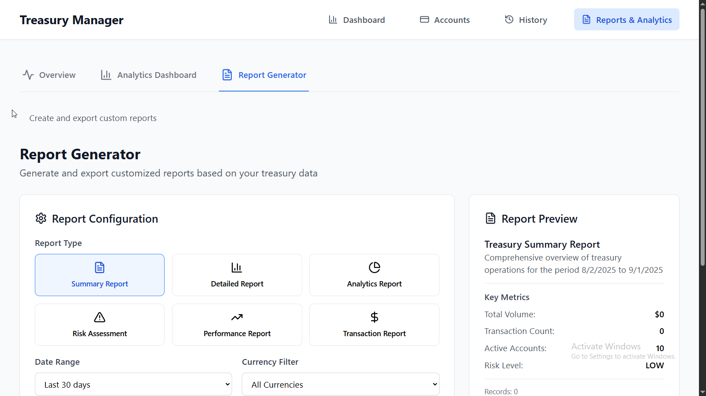
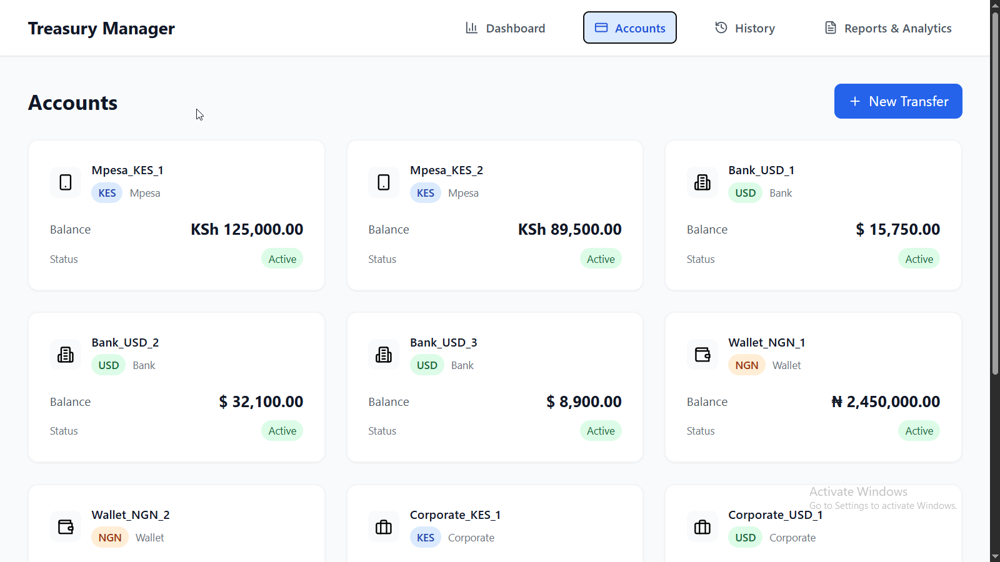
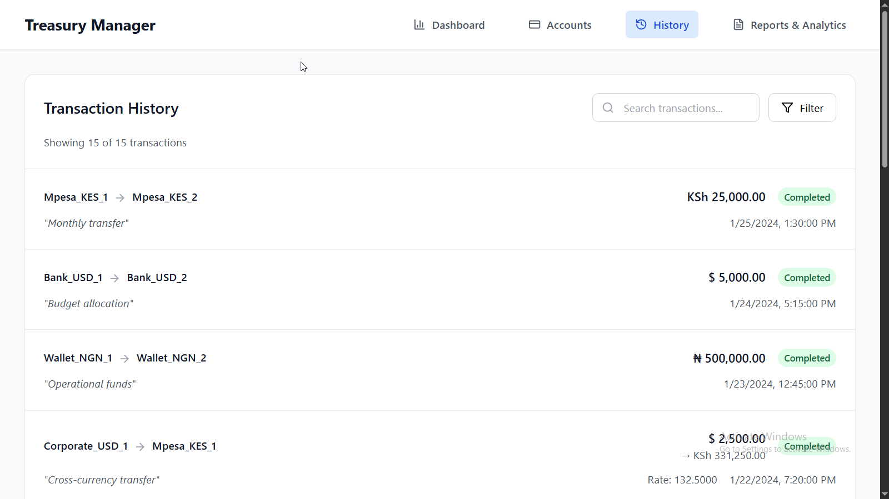

# Treasury Movement Simulator

A comprehensive web application for simulating and analyzing treasury operations across multiple currencies with advanced reporting and analytics capabilities.

## 🌟 Features

### Core Treasury Management
- **Multi-Currency Support**: Manage accounts in USD, KES, and NGN with real-time exchange rates
- **Account Management**: Handle different account types (Mpesa, Bank, Wallet, Corporate)
- **Cross-Currency Transfers**: Execute transfers with automatic currency conversion
- **Transaction History**: Track all transactions with detailed status information

### Advanced Analytics & Reporting
- **Interactive Dashboard**: Real-time charts, KPIs, and trend analysis
- **Risk Assessment**: Automated risk scoring with liquidity, concentration, and volatility metrics
- **Performance Analytics**: Account performance tracking and comparison
- **Custom Reports**: Generate detailed reports in multiple formats (JSON, CSV)
- **Data Visualization**: SVG-based charts including line, bar, pie, donut, and area charts
- **Trend Analysis**: Historical data analysis with growth metrics

## 🚀 Getting Started

### Prerequisites
- Node.js (version 18 or higher)
- npm or yarn package manager

### Installation

```bash
# Clone the repository
git clone https://github.com/riwogerald/treasury-movement-simulator.git

# Navigate to the project directory
cd treasury-movement-simulator

# Install dependencies
npm install

# Start the development server
npm run dev
```

### Building for Production

```bash
# Create production build
npm run build

# Preview production build
npm run preview
```

### Application Overview


*Main dashboard showing account overview, recent transactions, and quick actions*

## 📊 Analytics Features

### Overview Dashboard
Get a quick overview of your treasury operations with:
- **Total Balance Across All Currencies**
- **Active Account Count**
- **30-Day Transaction Volume**
- **Transaction Count Statistics**
- **Currency Distribution**
- **Risk Indicators and Alerts**

### Interactive Analytics Dashboard

#### Key Performance Indicators (KPIs)
- Transaction volume with period-over-period comparison
- Transaction count with trend indicators
- Active account metrics
- Average transaction size

#### Charts and Visualizations
- **Transaction Volume Over Time**: Line chart showing volume trends
- **Currency Distribution**: Donut chart with total volume breakdown
- **Account Performance**: Bar chart showing top-performing accounts by net flow
- **Transaction Count Trend**: Area chart displaying transaction frequency

#### Risk Assessment
- **Liquidity Risk**: Based on low-balance account analysis
- **Concentration Risk**: Measures balance distribution across accounts
- **Volatility Risk**: Analyzes transaction volume variance
- **Overall Risk Score**: Combined risk assessment with recommendations

#### Interactive Controls
- **Date Range Selection**: 7 days, 30 days, 3 months, or 1 year
- **Currency Filtering**: Filter data by specific currency
- **Real-time Refresh**: Update analytics with latest data


*Interactive analytics dashboard with charts, KPIs, and risk assessment*

### Report Generator


*Reports and analytics overview with quick access to different report types*


*Advanced report generation interface with customization options*

#### Report Types

1. **Summary Report**
   - High-level overview of treasury operations
   - Key metrics and currency breakdown
   - Risk assessment summary

2. **Detailed Report**
   - Complete analytics data dump
   - All computed metrics and metadata

3. **Analytics Report**
   - Transaction volume analysis
   - Account performance breakdown
   - Currency analytics
   - Trend analysis

4. **Risk Assessment Report**
   - Detailed risk metrics
   - Low balance account identification
   - Risk mitigation recommendations

5. **Performance Report**
   - Account performance ranking
   - Performance distribution analysis
   - Top performer identification

6. **Transaction Report**
   - Complete transaction history
   - Transaction status breakdown
   - Currency distribution analysis

#### Export Formats
- **JSON**: Structured data for programmatic use
- **CSV**: Tabular data for spreadsheet analysis

#### Configuration Options
- Date range selection
- Currency filtering
- Account-specific filtering
- Flexible report customization

## 🏗️ Technical Architecture

### Technology Stack
- **Frontend Framework**: React 18 with TypeScript
- **Styling**: Tailwind CSS
- **Icons**: Lucide React
- **Build Tool**: Vite
- **Type Checking**: TypeScript with strict mode

### Project Structure

```
src/
├── components/          # React components
│   ├── Charts.tsx       # Reusable chart components
│   ├── AnalyticsDashboard.tsx
│   ├── ReportGenerator.tsx
│   ├── AdvancedReports.tsx
│   └── ...
├── hooks/              # Custom React hooks
│   └── useAccounts.ts  # Main state management with analytics
├── utils/              # Utility functions
│   ├── analytics.ts    # Analytics computation functions
│   ├── currency.ts     # Currency conversion utilities
│   └── validation.ts   # Form validation
├── types/              # TypeScript type definitions
│   └── index.ts        # All application types
├── data/               # Static data and constants
│   └── constants.ts    # Initial data and configuration
└── App.tsx             # Main application component
```

### Key Components

#### `useAccounts` Hook
Central state management with extended analytics capabilities:
- Core account and transaction management
- Real-time analytics computation
- Risk assessment functions
- Performance tracking
- Helper functions for data insights

#### Analytics Utilities (`utils/analytics.ts`)
- Transaction volume calculation
- Account performance analysis
- Currency analytics
- Risk metrics computation
- Trend analysis
- Data export functions

#### Chart Components (`components/Charts.tsx`)
- `LineChart`: Time-series data visualization
- `BarChart`: Comparative data representation
- `PieChart`: Distribution visualization
- `DonutChart`: Enhanced pie chart with center content
- `AreaChart`: Filled area visualization

## 💡 Usage Examples

### Basic Treasury Operations

1. **View Dashboard**: Navigate to the Dashboard tab for overview metrics
2. **Manage Accounts**: Use the Accounts tab to view account details


*Account management interface showing all accounts with balances and details*

3. **Execute Transfers**: Click "New Transfer" to move funds between accounts


*Transfer creation form with currency conversion and validation*

4. **View History**: Check the History tab for transaction records


*Complete transaction history with filtering and status information*

### Advanced Analytics

1. **Access Reports**: Navigate to the "Reports & Analytics" tab
2. **Overview**: Get quick insights from the Overview tab
3. **Deep Analysis**: Use the Analytics Dashboard for detailed analysis
4. **Generate Reports**: Create custom reports using the Report Generator

### Custom Report Generation

```typescript
// Example: Generate a risk assessment report for the last 30 days
const reportConfig = {
  type: 'risk' as ReportType,
  dateRange: getDateRange(30),
  currency: undefined, // All currencies
  accountIds: undefined, // All accounts
  includeCharts: true,
  format: 'json' as ExportFormat,
  title: 'Monthly Risk Assessment',
  description: 'Risk analysis for the past 30 days'
};
```

## 🔧 Configuration

### Exchange Rates
Currency exchange rates are configured in `src/data/constants.ts`:

```typescript
export const EXCHANGE_RATES: ExchangeRate[] = [
  { from: 'USD', to: 'KES', rate: 132.50 },
  { from: 'USD', to: 'NGN', rate: 790.25 },
  // ... more rates
];
```

### Risk Thresholds
Low balance thresholds for risk assessment:

```typescript
const lowBalanceThresholds = {
  USD: 100,
  KES: 10000,
  NGN: 50000
};
```

## 🧪 Testing

### Sample Data
The application includes comprehensive sample data:
- **10 Sample Accounts** across different currencies and types
- **15 Sample Transactions** including completed, pending, and scheduled
- **Cross-Currency Transfers** with exchange rate calculations
- **Recent Transaction Data** for realistic analytics

### Development Testing

```bash
# Type checking
npx tsc --noEmit

# Build validation
npm run build

# Development server
npm run dev
```

## 📈 Analytics Metrics

### Key Performance Indicators
- **Transaction Volume**: Total value of transactions over time
- **Transaction Count**: Number of transactions in specified periods
- **Success Rate**: Percentage of completed vs. total transactions
- **Average Transaction Size**: Mean transaction value
- **Currency Market Share**: Distribution of transaction volume by currency

### Risk Metrics
- **Liquidity Risk**: 0-100 score based on low-balance account ratio
- **Concentration Risk**: 0-100 score measuring balance distribution
- **Volatility Risk**: 0-100 score analyzing transaction volume variance
- **Overall Risk Score**: Weighted combination of individual risk factors

### Trend Analysis
- **Growth Metrics**: Period-over-period percentage changes
- **Trend Indicators**: Up, down, or stable classifications
- **Historical Comparisons**: Current vs. previous period analysis

## 🤝 Contributing

1. Fork the repository
2. Create a feature branch (`git checkout -b feature/analytics-enhancement`)
3. Commit your changes (`git commit -am 'Add new analytics feature'`)
4. Push to the branch (`git push origin feature/analytics-enhancement`)
5. Create a Pull Request

## 📄 License

This project is open source and available under the [MIT License](LICENSE).

## 🙏 Acknowledgments

- Built with React and TypeScript for type safety
- Styled with Tailwind CSS for responsive design
- Icons provided by Lucide React
- Analytics and visualization implemented with native SVG

---

**Treasury Movement Simulator** - Comprehensive treasury management with advanced analytics and reporting capabilities.
